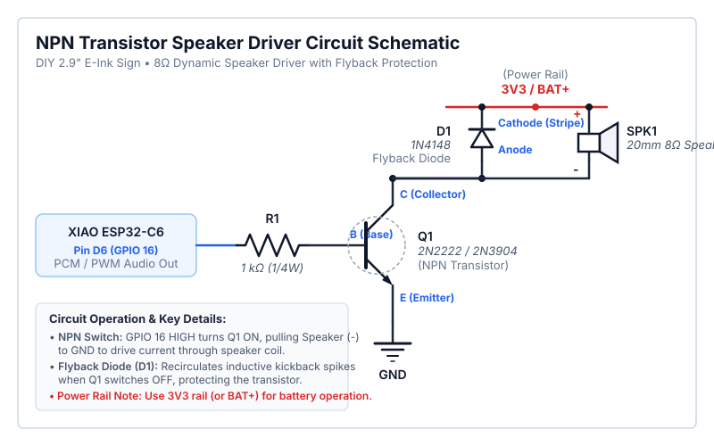

# DIY 2.9" E-Ink Sign: Breadboard Wiring & Schematics Guide

This document contains step-by-step breadboard prototyping instructions and electrical schematics for the DIY 2.9" E-Ink Sign project, followed by layout guidelines for the upcoming 30x70mm perf-board assembly phase.

---

## 1. Component Inventory

| Component | Description / Specification | Quantity |
| :--- | :--- | :--- |
| **MCU** | Seeed Studio XIAO ESP32-C6 (Headers soldered) | 1 |
| **Display** | WeAct Studio 2.9" 3-Color E-Paper Module (SPI interface, 8-pin harness) | 1 |
| **Battery** | 902540 3.7V 800mAh 2.96Wh 25C LiPo Battery (Integrated PCM) | 1 |
| **Battery Sense**| 2x 100kΩ 1/4W Resistors (Voltage Divider for `D0` / `GPIO 0` ADC) | 2 |
| **Switches** | 2-pin / 4-pin Momentary Tactile Pushbuttons | 2 |
| **Audio** | 20mm 8Ω Dynamic Speaker, NPN Transistor (2N2222/2N3904), 1kΩ Resistor, Flyback Diode (1N4148/1N4001) | 1 set |
| **Prototyping** | Standard Solderless Breadboard (400 or 830 tie-point) | 1 |
| **Wiring** | Dupont Jumper Wires (Male-to-Male, Male-to-Female) | ~15 |
| **Power** | USB-C Cable (XIAO onboard LiPo charger) | 1 |

---

## 2. XIAO ESP32-C6 Pinout Reference

```
                   +-------------------+
                   |   USB-C Connector |
                   +-------------------+
             (D0)  |  1 [ ]     [ ] 14 |  5V
     (CS)    (D1)  |  2 [ ]     [ ] 13 |  GND
     (DC)    (D2)  |  3 [ ]     [ ] 12 |  (D6)  (BUZZER)
     (RST)   (D3)  |  4 [ ]     [ ] 11 |  (D7)  (TX)
     (BUSY)  (D4)  |  5 [ ]     [ ] 10 |  (D8)  (SCK)
             (D5)  |  6 [ ]     [ ]  9 |  (D9)  (BOOT/REFRESH SW)
             3V3   |  7 [ ]     [ ]  8 |  (D10) (MOSI)
                   +-------------------+
```

---

## 3. Master Wiring & Interconnection Table

| Target Peripheral | Peripheral Pin | Cable / Wire Color | XIAO Silk Pin | XIAO GPIO | Functional Description |
| :--- | :--- | :--- | :--- | :--- | :--- |
| **E-Paper Display** | `VCC` | Red | `3V3` | - | 3.3V Power Supply |
| **E-Paper Display** | `GND` | Black | `GND` | - | Common Ground |
| **E-Paper Display** | `DIN` / `SDI` | Yellow / Blue | `D10` | GPIO 18 | SPI MOSI (Master Out Slave In) |
| **E-Paper Display** | `CLK` / `SCLK` | Orange | `D8` | GPIO 19 | SPI SCK (Serial Clock) |
| **E-Paper Display** | `CS` | White | `D1` | GPIO 1 | SPI Chip Select (Active Low) |
| **E-Paper Display** | `DC` | Green | `D2` | GPIO 2 | Data / Command Control |
| **E-Paper Display** | `RST` | Violet | `D3` | GPIO 21 | Display Hardware Reset |
| **E-Paper Display** | `BUSY` | Gray | `D4` | GPIO 22 | Display Busy Status (Active High) |
| **Boot Switch** | Leg 1 | Jumper | `D9` | GPIO 9 | Force-Refresh Input (Internal Pullup) |
| **Boot Switch** | Leg 2 | Jumper | `GND` | - | Ground connection on press |
| **Reset Switch** | Leg 1 | Jumper | `RST` / `CHIP_PU` | CHIP_PU | Hardware Chip Reset |
| **Reset Switch** | Leg 2 | Jumper | `GND` | - | Ground connection on press |
| **NPN Transistor Base** | Base Pin | 1kΩ Resistor | `D6` | GPIO 16 | PWM / PCM Audio Output |
| **Speaker Positive** | Positive (`+`) | Red Wire | `3V3` (or `BAT+`) | - | 3.3V Power Supply (Note: XIAO 5V pin has 0V on battery power) |
| **Speaker Negative** | Negative (`-`) | Black Wire | NPN Collector | - | Switch path through transistor to GND |
| **Transistor Emitter** | Emitter Pin | Jumper Wire | `GND` | - | Common Ground |
| **Battery Sense Divider** | `BAT+` -> `D0` -> `GND` | 2x 100kΩ Resistors | `D0` / `A0` | GPIO 0 | Analog Battery Voltage Sense (Divider Ratio 2.0) |

---

## 4. System Interconnection Diagram (Mermaid)

```mermaid
graph TD
    subgraph Power ["Power Rail (USB-C)"]
        USB["USB-C 5V"] --> XIAO_REG["XIAO 3.3V LDO"]
        XIAO_3V3["XIAO 3V3 Rail"]
        XIAO_GND["XIAO Common GND"]
    end

    subgraph XIAO ["Seeed Studio XIAO ESP32-C6"]
        GPIO18["D10 / GPIO 18 (MOSI)"]
        GPIO19["D8 / GPIO 19 (SCK)"]
        GPIO1["D1 / GPIO 1 (CS)"]
        GPIO2["D2 / GPIO 2 (DC)"]
        GPIO21["D3 / GPIO 21 (RST)"]
        GPIO22["D4 / GPIO 22 (BUSY)"]
        GPIO9["D9 / GPIO 9 (BOOT)"]
        GPIO16["D6 / GPIO 16 (BUZZER)"]
        CHIP_PU["RST / CHIP_PU"]
    end

    subgraph EINK ["WeAct 2.9 Inch E-Paper Display"]
        E_VCC["VCC (3.3V)"]
        E_GND["GND"]
        E_DIN["DIN"]
        E_CLK["CLK"]
        E_CS["CS"]
        E_DC["DC"]
        E_RST["RST"]
        E_BUSY["BUSY"]
    end

    subgraph INPUTS ["Tactile Switches & Peripherals"]
        SW_BOOT["Boot / Refresh Button"]
        SW_RST["Hardware Reset Button"]
        SPEAKER["20mm Dynamic Speaker"]
        NPN["NPN Transistor Switch"]
    end

    %% Power Connections
    XIAO_3V3 --> E_VCC
    XIAO_GND --> E_GND
    XIAO_GND --> SW_BOOT
    XIAO_GND --> SW_RST
    XIAO_GND --> NPN
    USB -->|5V Rail| SPEAKER

    %% Display SPI Connections
    GPIO18 -->|SPI MOSI| E_DIN
    GPIO19 -->|SPI SCK| E_CLK
    GPIO1 -->|CS Signal| E_CS
    GPIO2 -->|Data/Cmd| E_DC
    GPIO21 -->|Display Reset| E_RST
    E_BUSY -->|Busy Status| GPIO22

    %% Switch & Audio Connections
    GPIO9 -->|Force Refresh| SW_BOOT
    CHIP_PU -->|MCU Hardware Reset| SW_RST
    GPIO16 -->|PWM / PCM Audio (1kΩ)| NPN
    NPN -->|Collector Drive| SPEAKER
```

---

## 5. Step-by-Step Breadboard Construction Guide

### Step 1: Place Microcontroller
1. Straddle the **XIAO ESP32-C6** across the center divider notch of the breadboard (e.g., Row 1 to Row 7, columns E and F).
2. Ensure pin 1 (`D0`) is aligned at Row 1 column E and pin 14 (`5V`) is at Row 1 column F.

### Step 2: Establish Power Rails
1. Connect XIAO pin 7 (`3V3`) to the positive breadboard power rail (`+`).
2. Connect XIAO pin 13 (`GND`) to the negative breadboard ground rail (`-`).

### Step 3: Wire WeAct 2.9" E-Paper Display
Connect the 8-pin display harness directly into the XIAO pins or breadboard rows:
1. `VCC` -> Connect to `3V3` power rail.
2. `GND` -> Connect to `GND` ground rail.
3. `DIN` -> Connect to XIAO `D10` (Row corresponding to pin 8).
4. `CLK` -> Connect to XIAO `D8` (Row corresponding to pin 10).
5. `CS`  -> Connect to XIAO `D1` (Row corresponding to pin 2).
6. `DC`  -> Connect to XIAO `D2` (Row corresponding to pin 3).
7. `RST` -> Connect to XIAO `D3` (Row corresponding to pin 4).
8. `BUSY`-> Connect to XIAO `D4` (Row corresponding to pin 5).

### Step 4: Add Tactile Pushbuttons & Hardware Interface Controls
1. **Top Interactive Action / Screen-Cycle Microswitch (`D9` / `GPIO 9`):**
   - **Physical Placement:** Mounted facing the **top of the unit** with a **raised button** for easy daily access.
   - **Wiring:** Terminal A -> Connect to XIAO `D9` (Pin 9 / GPIO 9); Terminal B -> Connect to `GND`.
   - **Interaction Modes:**
     - **Short Press:** Wakes device from deep sleep, sends `X-Display-Action: cycle` header to backend (bypassing 304 cache) to cycle to the next screen/quote of the day, updates display, and re-enters sleep.
     - **Long Press (>400ms):** Enters **Maintenance Mode** (starts Web Server & WebSockets REPL for file uploads and config changes).
2. **Back Recessed Reset Microswitch (`RST` / `CHIP_PU`):**
   - **Physical Placement:** Mounted on the **back panel**, recessed behind a small pinhole aperture to prevent accidental presses.
   - **Wiring:** Terminal A -> Connect to XIAO `RST` / `CHIP_PU` pad; Terminal B -> Connect to `GND`.
   - **Function:** Hard system chip reset.

### Step 5: Add 20mm Speaker & NPN Transistor Driver
1. Connect NPN Transistor **Emitter** (`E`) to `GND` rail.
2. Connect a **1kΩ Resistor** between XIAO `D6` (Pin 12 / GPIO 16) and NPN Transistor **Base** (`B`).
3. Connect NPN Transistor **Collector** (`C`) to Speaker negative (`-`) lead.
4. Connect Speaker positive (`+`) lead to `3V3` (or `BAT+`) power rail *(Note: On XIAO ESP32-C6, the `5V` pin is disconnected during untethered battery power)*.
5. Place a **Flyback Diode** (1N4148/1N4001) in parallel across speaker leads (Cathode to `3V3`/`BAT+`, Anode to Collector).

#### Speaker Circuit Schematic Diagram


---

## Modular Vector Schematic Diagrams

For standalone, full-resolution circuit diagrams, see the [`schematics/`](./schematics/README.md) directory:

1. **[Speaker Driver Circuit Schematic](./schematics/speaker_schematic.svg)**
2. **[Battery Charging & Voltage Sensing Schematic](./schematics/battery_sensing_schematic.svg)**
3. **[E-Paper Display SPI Harness Schematic](./schematics/display_mcu_schematic.svg)**
4. **[Microswitch Breakouts Schematic](./schematics/microswitch_schematic.svg)**


---

## 6. Follow-on Perf-Board Layout & Planning (30x70mm)

When transitioning from breadboard to the final prototyping board, we will use a **30mm x 70mm perf-board**.

### Board Specifications
- **Dimensions:** 30 mm x 70 mm
- **Grid Layout:** 10 x 24 through-hole matrix (240 holes total)
- **Short Sides (Width):** Labeled **A through J** (10 columns, 2.54mm pitch)
- **Long Sides (Length):** Labeled **1 through 24** (24 rows, 2.54mm pitch)
- **Edge Rails:** 8 solder pads along each edge on both top and bottom sides.

### Perf-Board Layout Map (Draft)

```
        Columns A B C D E F G H I J
Row 01  [ ][ ][ ][ ][ ][ ][ ][ ][ ][ ]   Top Edge Pads (1-8)
Row 02  [ ][ ][ ][ ][ ][ ][ ][ ][ ][ ]
Row 03  +-- XIAO ESP32-C6 Header --+
Row 04  | [D0] [D1] [D2] [D3] [D4] |   Cols C-G / Rows 3-7 (Left socket)
Row 05  |  D5   3V3  5V   GND  D6  |
Row 06  |  D7   D8   D9  D10   --  |   Cols C-G / Rows 3-7 (Right socket)
Row 07  +--------------------------+
Row 08  [ ][ ][ ][ ][ ][ ][ ][ ][ ][ ]
Row 09  [ ][ ][ ][ ][ ][ ][ ][ ][ ][ ]
Row 10  [ ]  [ SW1 (RST) ]    [ ][ ]
Row 11  [ ][ ][ ][ ][ ][ ][ ][ ][ ][ ]
Row 12  [ ]  [ SW2 (BOOT)]    [ ][ ]
Row 13  [ ][ ][ ][ ][ ][ ][ ][ ][ ][ ]
Row 14  [ ][ ]  (BUZZER)      [ ][ ]
Row 15  [ ][ ][ ][ ][ ][ ][ ][ ][ ][ ]
Row 16  [ ][ ][ ][ ][ ][ ][ ][ ][ ][ ]
Row 17  +-- 4x2 Display Header --+     Pin 1 (VCC)  Pin 2 (GND)  Pin 3 (DIN)  Pin 4 (CLK)
Row 18  | [1]  [2]  [3]  [4]     |     Cols D, E, F, G / Row 17
Row 19  | [5]  [6]  [7]  [8]     |     Cols D, E, F, G / Row 18
Row 20  +------------------------+     Pin 5 (CS)   Pin 6 (DC)   Pin 7 (RST)  Pin 8 (BUSY)
...
Row 24  [ ][ ][ ][ ][ ][ ][ ][ ][ ][ ]   Bottom Edge Pads (1-8)
```

### 2x4 (4x2) Display Header Pinout Matrix
| Header Pin # | Signal Name | Wire / Trace Destination |
| :--- | :--- | :--- |
| **Pin 1** (Row 17, Col D) | `VCC` | `3V3` Power Rail |
| **Pin 2** (Row 17, Col E) | `GND` | `GND` Power Rail |
| **Pin 3** (Row 17, Col F) | `DIN` / `SDI` | XIAO `D10` (GPIO 18 / SPI MOSI) |
| **Pin 4** (Row 17, Col G) | `CLK` / `SCLK` | XIAO `D8` (GPIO 19 / SPI SCK) |
| **Pin 5** (Row 18, Col D) | `CS` | XIAO `D1` (GPIO 1 / Chip Select) |
| **Pin 6** (Row 18, Col E) | `DC` | XIAO `D2` (GPIO 2 / Data-Command) |
| **Pin 7** (Row 18, Col F) | `RST` | XIAO `D3` (GPIO 21 / Display Reset) |
| **Pin 8** (Row 18, Col G) | `BUSY` | XIAO `D4` (GPIO 22 / Busy Status) |

### Perf-Board Routing Rules
1. **XIAO Placement:** Position the XIAO MCU near one end (Rows 3-7) using female header sockets so the USB-C port points outwards.
2. **Display Connector Placement:** Mount a **4x2 female header socket** in Rows 17-18 (Columns D-G) to receive the display's soldered 4x2 male pins.
3. **Control Switches:** Mount tactile switches in Rows 10 and 12, leaving clear clearance around button caps.
4. **Buzzer:** Mount the piezo transducer between Rows 14-15.
5. **Edge Pads Usage:**
   - Reserve 4 outer edge pads for incoming Li-ion battery leads (`B+`, `B-`) and battery switch in later perf-board testing.
   - Use remaining edge pads as common Ground (`GND`) or `3V3` bus distribution points.

---

## 7. Pre-Power Checklist & Verification

Before plugging in the USB-C cable to power the breadboard:

- [ ] **Visual Continuity Check:** Verify no jumper wire leads are touching adjacent breadboard pins.
- [ ] **Power & Ground Polish:** Confirm `3V3` connects only to display `VCC`, and all `GND` lines share a common rail.
- [ ] **SPI Bus Sanity:** Confirm MOSI (`D10`), SCK (`D8`), CS (`D1`), and DC (`D2`) match the pin defines in `firmware/src/config.h`.

---

## 8. LiPo Battery Direct-Soldering & Safety Guidelines

For the 902540 3.7V 800mAh 25C LiPo battery (direct soldered to XIAO `BAT+` / `BAT-` pads):

> [!CAUTION]
> **Cut & Strip One Wire at a Time!**
> Never cut both the Red (`+`) and Black (`-`) wires simultaneously with a metal wire cutter. The metal jaw will create a direct short circuit across the battery terminals.

### Step-by-Step Soldering Sequence:
1. **Clip, strip, and tin the RED wire first.**
2. Protect the exposed black wire lead with electrical tape while soldering the red wire.
3. Solder the **RED wire** to the **`BAT+` pad** on the underside of the XIAO ESP32-C6.
4. Clip, strip, tin, and solder the **BLACK wire** to the **`BAT-` pad**.
5. Apply a small drop of hot glue or liquid electrical tape over the solder joints on the board for mechanical strain relief.
- [ ] **Switch Wiring:** Ensure pushbuttons short to `GND` when pressed and do not short `3V3` to ground.
